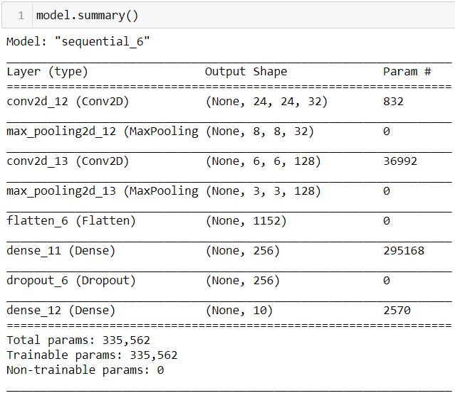
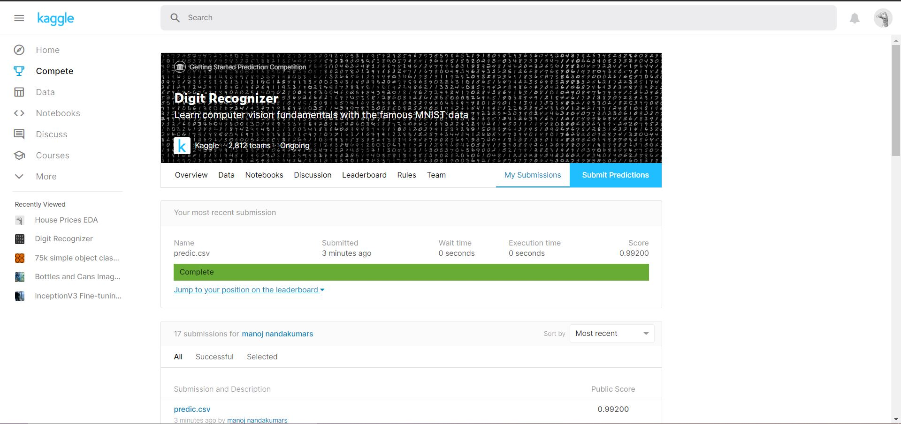

# Digit-recognizer
   This is a my first project after learning tensorflow.
   This is also a kaggle competetion.
## ABOUT PROJECT 
Its a nueral network which is implemented using tensorflow(keras)
 Its a pretty basic model because convolution and pooling would just resize image according to the needits only 28 X 28 image. 
the summary is bellow and only additional thing i cropped before fitting, it increased result a bit. 

 I got about 0.99200 accuracy 

